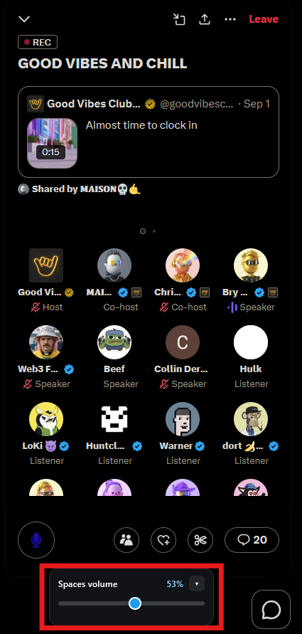
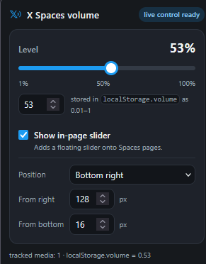
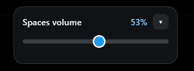

# X Spaces Volume Control (Firefox extension)

<p align="center">
  
</p>

Controls the playback volume of X/Twitter **Spaces** by driving the page's
`localStorage["volume"]` value, and applies the change **live** (no page reload)
by patching the page's audio APIs. It also injects an in-page slider so you can
adjust the level without opening the toolbar popup.

## What's in the box

```
spaces-volume/
├── manifest.json              MV3 manifest (Firefox 140+)
├── background.js              seeds default settings on install
├── icons/
│   ├── icon.svg               blue mark: extension icon + fallback
│   ├── icon-white.svg         white mark: toolbar on dark themes
│   └── icon-black.svg         black mark: toolbar on light themes
├── popup/
│   ├── popup.html             toolbar popup: live slider, position, toggles
│   ├── popup.css
│   └── popup.js               talks to the tab, persists settings
├── content/
│   ├── volume-hook.js         MAIN world, document_start: audio API patches
│   └── volume-ui.js           ISOLATED world: localStorage + in-page slider
└── docs/                      logo + screenshots (not part of the extension)
```

Three vectors of the same mark — the Mathematical Double-Struck Capital X
(**𝕏**, U+1D54F) with sound waves — byte-identical apart from the fill colour, so
the shape cannot drift between them:

| File | Colour | Used for |
| --- | --- | --- |
| `icons/icon.svg` | X blue `#1d9bf0` | the extension icon (`icons`), the `default_icon` fallback, and the popup header |
| `icons/icon-white.svg` | white | the toolbar button on **dark** themes |
| `icons/icon-black.svg` | black | the toolbar button on **light** themes |

Firefox renders SVG icons natively, so no separate raster sizes are needed and
the icon stays sharp on HiDPI screens. All three have a **transparent
background** (no tile), so each has to carry itself against whatever sits behind
it — which is why the fallback stays the accent blue, a colour that survives on
either toolbar.

`docs/logo.png` is the same mark rendered to a 516×416 raster on a transparent
background, for places that will not take SVG — a store listing, a repo social
preview. It is not square, so it is not a substitute for the `icons` entries.

### Theme-aware toolbar icon

`action.theme_icons` (Firefox 109+; Chrome ignores it) swaps the toolbar icon
with the theme. **The `light`/`dark` keys name the theme's *text* colour, not the
icon's**, which is the easy part to get backwards:

- `"light"` — a theme using light text, i.e. a **dark** theme → the **white** icon
- `"dark"` — a theme using dark text, i.e. a **light** theme → the **black** icon

`default_icon` is kept as the blue icon for browsers that ignore `theme_icons`.

### The mark

The glyph is the **real U+1D54F design** (including the doubled
`top-left → bottom-right` stroke), stored as vector path data rather than live
`<text>` so it needs no maths font installed — a `<text>` element would render as
tofu (▯) on systems without one. The outline is derived from **DejaVu Sans Bold**,
whose permissive licence allows it to be redistributed inside a shipped
extension; not every font containing the glyph is usable that way. The bold
weight keeps the glyph legible at 16 px in the toolbar.

Chrome does not support SVG manifest icons, so if you ever port this extension
there, export PNGs at 16/32/48/96/128 px and reference those instead.

## Screenshots

The in-page slider over a live Space — parked bottom-left here, outlined in red
so it stands out against the dark UI:



The toolbar popup: level slider, the in-page slider toggle, and its corner and
offsets.



Close-up of the in-page slider. It applies as you drag, and the chevron collapses
it to a small pill.



None of `docs/` is part of the built extension, so exclude it when packaging:
`web-ext build --ignore-files "docs"`. Use `"docs"` rather than `"docs/**"` —
the latter still leaves an empty `docs/` entry in the zip.

## Install (temporary, for development)

1. Open `about:debugging#/runtime/this-firefox` in Firefox.
2. Click **Load Temporary Add-on…**.
3. Select `spaces-volume/manifest.json`.

The add-on stays loaded until Firefox restarts. To make it permanent you must
sign it (unsigned MV3 extensions cannot be installed permanently in release
Firefox), e.g. with `web-ext sign` against an AMO API key, or load it from a
Developer Edition / Nightly profile with
`xpinstall.signatures.required = false`.

**Requires Firefox 140 or newer** (desktop; 142+ on Android) — the extension uses
`world: "MAIN"` content scripts (Firefox 128+) and declares the mandatory
`data_collection_permissions` manifest key, which desktop Firefox added in 140.

## Usage

- **Toolbar popup** — the slider applies live as you drag: each move writes the
  value to `localStorage["volume"]` and pushes it to the player. There is no
  Apply button, because none is needed.
- **In-page slider** — appears on Spaces pages (`/i/spaces/…`) or whenever a
  Space dock is on the page. It behaves the same way and collapses to a small
  pill. Turn it off in the popup.
- **Position** — pick which corner the in-page slider sits in, and how many
  pixels it sits from the two edges that corner uses. The labels follow the
  corner ("From right" / "From top" for a top-right corner). Offsets are clamped
  to 0–999 px. The panel is positioned with inline offsets rather than fixed CSS,
  and all four edges are written each time (`auto` for the two the corner does
  not use) — leaving a stale `left` beside a new `right` would stretch the panel
  between them.
- The sliders run **1 – 100** in whole percent. That is a display choice: the
  value written to `localStorage["volume"]` is still the **0.01 – 1** fraction
  the player expects, so 1% → `0.01` and 100% → `1` (`percentToVolume` /
  `volumeToPercent` in `popup.js` and `content/volume-ui.js`). Values are
  clamped in every code path and persisted both in `browser.storage.local`
  (your default) and in the page's `localStorage["volume"]`.
- The popup's detail line always shows both, e.g.
  `42% · localStorage.volume = 0.42`, so the stored value is never a mystery.

## How the live (no-reload) application works

`localStorage` alone is usually only read once when the player initialises, so
the extension also patches the page *before* any page script runs:

1. **`HTMLMediaElement.prototype.volume`** — the page's intended volume is
   remembered per element in a `WeakMap` and the value actually written is
   `intent × master`. Because the base is always recomputed from the stored
   intent, a page that reads `.volume` back and writes it again cannot compound
   the multiplier.

   Elements are **tracked, not re-discovered**. A DOM scan is not enough: X's
   Spaces player (like many players) creates its media element and never appends
   it to the document, and a detached element is invisible to
   `querySelectorAll`. A level change would then silently never reach the one
   element that matters, and would only appear to "stick" later, when something
   else happened to write `.volume` again. So every element is registered when it
   is created (`Document.prototype.createElement` / `createElementNS`, `new
   Audio`), first played, or first written to, and applied to directly from that
   set from then on. Shadow roots are covered via `attachShadow`, and
   `innerHTML`-injected media via a `MutationObserver`.

   Elements that are gone *and* silent are pruned, but a detached element that is
   still playing stays tracked — it is still audible, and players detach their
   element during rebuilds while audio keeps playing. The popup's **tracked
   media** count reflects this set, so it can exceed what a DOM scan would find.
2. **`localStorage["volume"]`** — always written, so the change survives
   reloads, new tabs and X's own player init, and works with X's native volume
   control state.

There is deliberately **no Web Audio support**. The audible path is the media
element, handled by (1); scaling a shared `GainNode.gain` graph instead would
risk affecting unrelated audio such as local mic processing, without reaching
the level the player actually renders at.

Cross-world plumbing: `volume-hook.js` (MAIN) has no extension APIs, so
`volume-ui.js` (ISOLATED) drives it with `xspaces:volume-set` /
`xspaces:volume-get` CustomEvents whose `detail` is a JSON **string** (string
details pass the isolation boundary intact in every browser).

The popup → tab direction uses `tabs.sendMessage`; if the content script isn't
there yet (extension reloaded while the tab stayed open) the popup injects both
scripts on demand with `scripting.executeScript`. A stale copy left in the tab
answers unknown messages instead of throwing, so `sendToTab` treats that reply as
"not there" and re-injects — otherwise the setting would silently never apply.
Re-injection is safe because `volume-ui.js` returns early if a live copy is
already installed.

### Who owns the level

**The level you pick is authoritative, and the extension defends it.** This
matters because X's player re-persists *its own* volume periodically and has no
idea the extension changed anything — so it writes its old value back into
`localStorage["volume"]`.

Adopting that value would make the slider snap back to where it started a second
or two after you moved it, taking the audio with it. So the 2 s drift poll does
the opposite — if the page's stored value drifts from yours, the extension
**puts yours back**:

| Source of change | Handling |
| --- | --- |
| Your slider / popup | Authoritative. Written to `localStorage` and pushed to the hook. |
| X's player re-persisting its own level | Detected by the 2 s drift poll (same tab) and overwritten with your level. |
| Another tab/window (a real `storage` event) | Adopted, so tabs stay in sync. |

If you genuinely want to hand control back to X, clear the extension's stored
level — the extension will then adopt whatever X has.

### Watching for interference

The hook checks whether it was the first to wrap
`HTMLMediaElement.prototype.volume`, and keeps checking that its setter is still
the installed one. If another script wrapped it before or after, the popup shows
**volume conflict** instead of pretending everything is fine.

This catches a real failure mode: a general-purpose tab-volume extension
patching media volume on top of ours. It can capture our patched descriptor as
"native", so its writes flow through our setter and our level appears to apply
only when *its* apply cycle runs. If you see this warning, disable the other
extension.

## Troubleshooting

| Symptom | Try |
| --- | --- |
| Popup says "volume conflict" | A second script is patching media volume on this page (usually another Spaces-volume extension). Disable it — two layers of scaling will fight over the level. |
| Slider changes have no audible effect, other apps work | The level is applied to the tracked media element. If some other extension owns the audio route, disable it and retest. |
| Slider has no effect | Check the popup status: "hook missing" means reload the tab; "volume conflict" means another extension is fighting for the audio. |
| Slider snaps back after a moment | The extension re-asserts your level every 2 s — see "Who owns the level". If it still happens, X has changed the storage key; update `STORAGE_KEY`. |
| Change only becomes audible after ~30 s | Something else owns the audio route or is re-applying its own level. Check for a "volume conflict" warning and disable the other extension. |
| Popup changes have no effect on the page | The tab is running a stale copy of the content script (content scripts only re-inject on a page load). The popup detects this and re-injects automatically; if it still fails, reload the tab. |
| Popup says "hook missing" | Reload the tab once so the `document_start` hook runs. |
| Popup says "not an X tab" | The level is still saved as your default; open `x.com`/`twitter.com`. |
| No in-page slider | It only shows on Spaces pages or when a Space dock is present; check the popup toggle. |

If X ever changes the storage key, update `STORAGE_KEY` in
`content/volume-hook.js` and `content/volume-ui.js`.

## Tests

Two Node harnesses exercise the logic without a browser (no dependencies):

```
node tools/hook-test.mjs   # volume math: scaling, echo/compounding, clamping, bridge
node tools/ui-test.mjs     # content-script startup, localStorage writes, popup messaging
```
